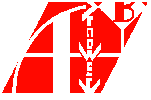

# Materiale Informatica Superiori

La seguente repository contiene tutto il materiale prodotto durante il corso di informatica presso il Liceo P.Carcano di Como

### Materiali presenti

## AlgoBuild  

AlgoBuild è un programma che permette di studiare **flow charts** e di realizzare semplici programmi a grafo. Durante il corso AlgoBuild è stato utilizzato inizialmente per comprendere al meglio come funziona un programma a livello di chart. Nella rispettiva cartella sono presenti programmi con operazioni di base sotto forma di flow charts

# BYOB 
BYOB (Build Yout Own Blocks), anche detto Snap!, è un linguaggio di **programmazione a blocchi** basato su Scratch che permette di fare semplici programmi grazie a blocchi che se ordinati producono outputs su un personaggio chiamato Alonso. È molto utile all'inizio di un percorso di programmazione per iniziare a comprendere l'ordine delle istruzioni e semplici comandi di programmazione di base. Nella rispettiva cartella sono presenti semplici programmi di disegno, operazioni e calcolo matematico

# C 
**C** è uno dei linguaggi di programmazione più longevi ed usati al mondo. Nella relativa cartella sono presenti programmi per eseguire semplici I/O, operazioni basilari, lettura e scrittura su file

# HTML (con CSS e JavaScript) 
**HTML** è il linguaggio di markdown in cui sono scritte la maggior parte delle pagine web. Viene utilizzato spesso con **CSS** e **Javascript**, rispettivamente per curare l'aspetto grafico ed eventuali aspetti interattivi delle pagine. Nella rispettiva cartella sono presenti alcune prove di semplici siti web, e un progetto chiamato "Tutto è connesso" realizzato in ambito di un lavoro di educazione civica

# Cisco Packet Tracer 
**Cisco Packet Tracer** è un programma utilizzato per simulazione di reti virtuali. Nella rispettiva cartella sono presenti alcuni progetti di semplici reti LAN connesse tra di loro con setup di procedure come DNS, DHCP, Router o Email

# Python 
**Python** è uno dei linguaggi più versatili ed usati al mondo. Nella rispettiva cartella sono presenti alcuni semplici programmi con semplici giochi basati su I/O, operazioni di lettura e scrittura su file e semplici operazioni

# SQL 
**SQL** (Structured Query Language) è un linguaggio utilizzato per gestire databases di dati. Nella rispettiva cartella sono presenti semplici programmi di gestione di piccoli databases, con inserimento e rimozione di elementi o dati da essi

*Francesco Corrado 2024*

